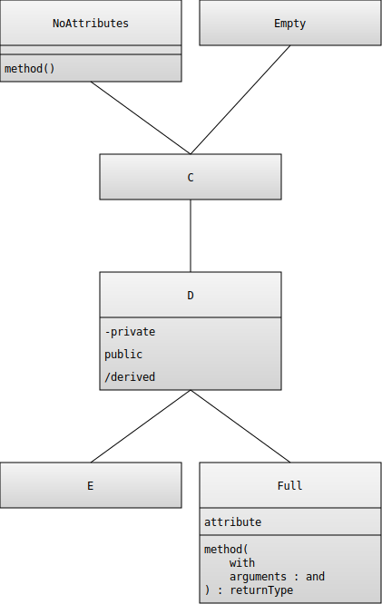
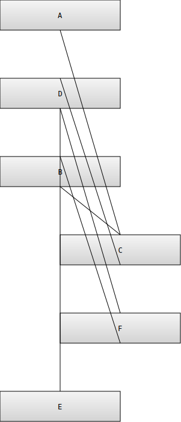

# Manual testing
Except for the automatic test suite there is a bunch of manual tests that have to pass as well.
They are divided in two parts, the first part validating the rendered diagrams doesn't have any
exact output and have to be decided manually if the output is correct or not.

## Checking the diagrams
Login with the username `Test` and password `tester` and go through the saved diagrams
to make sure the look correct and doesn't have regressed.

The current output for the diagrams are:
### Test Example

### Test Associations

### Test Loop 1

### Test Loop 2

### Test MVC

### Test Advanced

## Checking the application
### Test register
1. Make sure that you can not and get friendly errors for
  - Creating a user with too short (less than the characters) or without a username
  - Creating a user without a password
  - Creating a user when the password confirmation doesn't match
  - Creating a user with an existing username (for example Test)
1. Make sure that you are logged in after registration.
1. Make sure that you remain logged in after a browser restart

### Test logout
1. Make sure that you can log out
1. Make sure that you remain logged out after a browser restart

### Test login
1. Make sure that you can log in with your registered user
1. Make sure that you remain logged in after a browser restart

### Test creating a diagram
Should be done both when logged out and when logged in.
Write code for diagrams and make sure the rendered version is correct.
Remember to test

- Multiple classes
- Class extension (that you can define a class and then add methods or attributes to it)
- Associations, make sure you get in:
  - Previously defined classed
  - Not previously defined classes
  - Named (although the name won't show for now)
- Attributes
  - With type
  - Without type
- Methods
  - With parameters
  - Without parameters
  - With return type
  - Without return type

### Test links to diagrams
As logged out and when logged in that that the link to the image is correct when editing the diagram
As logged in that the links to the images is correct on the "My Diagrams" page

### Test Saving a diagram
1. Make sure that you can create a new diagram and save it
1. Make sure that it shows up on the "My Diagrams" page
1. Log out and login as another user
1. Make sure the diagram don't show up on this users "My Diagrams" page

### Test modify a diagram
Don't modify or delete the tests on `Test` user

1. Test that you can save a modified diagram
1. Make sure the image on "My Diagram" is updated
1. Make sure the change is present after a refresh
1. Make sure that you can change the name of a diagram
1. Make sure the name on "My Diagram" is updated
1. Make sure the change is present after a refresh
1. Make sure you can delete the diagram
1. Make sure the diagram is not present after a refresh
